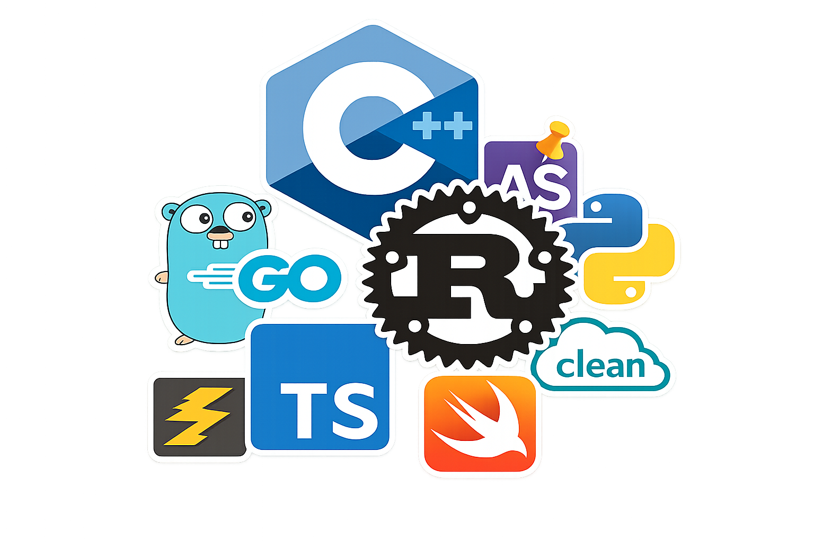

# WebAssembly (WASM)


---


---

## Qu'est-ce que WebAssembly ?

- **Format binaire portable** pour le web
- **Cible de compilation** pour langages comme C, C++, Rust
- S'exécute dans le navigateur **à vitesse quasi-native**
- **Standard W3C** supporté par tous les navigateurs modernes

### En bref

Du code compilé qui tourne dans ton navigateur aussi vite que du code natif, via une couche de traduction bas niveau.

---


---

## Comment ça fonctionne ?

### Le Pipeline

1. **Écriture** → Code en langage source compilé
2. **Compilation** → Binaire `.wasm`
3. **Chargement** → Import dans JavaScript
4. **Exécution** → Environnement d'execution dans le navigateur

---

### Architecture

- **Format binaire** : `.wasm` (compact et rapide)
- **Stack-based VM** : Machine virtuelle optimisée
- **Linear memory** : Espace mémoire sandboxé
- **JavaScript glue** : Bindings automatiques entre JS et WASM

---

### Avantages Techniques

- **Parsing rapide** : Format binaire dense
- **Typage statique** : Vérification à la compilation
- **Compilation AOT** : Ahead-of-time dans le navigateur
- **Sécurité** : Sandbox isolé de la machine hôte
- **Performance** : Performances quasi native

---

## À quoi ça sert ?

### Cas d'Usage Principaux

#### Performance Critique

- **Jeux vidéo** : Unity, Unreal Engine portés en WASM
- **Calcul intensif** : Simulations, physique, maths
- **Traitement multimédia** : Encodage/décodage vidéo, audio, DSP
- **Compression/décompression** : Algorithmes lourds
- **Emulateurs** : Vieilles consoles, vieux hardware.

---

#### Applications

- **CAD/3D** : AutoCAD, Figma utilisent WASM
- **Outils de design** : Photoshop Web
- **Bases de données** : SQLite compilé en WASM
- **Linux LOL 😂** : [Linux compilé en wasm](https://joelseverin.github.io/linux-wasm/)

---

#### Réutilisation de Code

- **Bibliothèques legacy** : Code C/C++ existant
- **Logique métier partagée** : Même code client/serveur
- **Cross-platform** : Un seul codebase pour web et natif

---

### Quand NE PAS utiliser WASM

- Manipulation DOM
- Applications CRUD simples
- Prototypes rapides
- Tout ce qui est dans le domaine des technologies Web

---

## Quels langages ?



---

### Langages Candidats

#### C/C++ : le candidat original

La cible originale de WASM.

C'est un très bon choix mais C/C++ proposent une grande selection d'armes à feu pour **se tirer une balle dans le pied**.

Ca reste un choix très pertinent pour des codebases existantes.

---

#### C# : Java en moins pire

C'est java en moins pire.

Compilé, ça embarque son runtime ce qui n'est pas génial quand on doit envoyer son binaire à l'utilisateur à chaque fois.

Peut être bien pour des codebases complexes. Il y a un framework microsoft microsoft qui s'appelle Blazor autour de ça.

---

#### Go : C'est bien mais c'est pas ce qu'on veut

Compilé, Go embarque un runtime avec un garbage collector, ça fonctionne mais ça serait mieux sans.

---

#### AssemblyScript : Pour ceux qui ont peur des vrais languages

C'est construit autour de la promesse d'écrire quelque chose de similaire à TS et de le compiler en WASM, mais c'est à coté de la plaque.

---

#### Rust : Le language idéal pour WASM

Par un concours de circonstances, Les planètes se sont alignées et un language est arrivé avec des propositions qui s'alignent très bien avec WASM.

---

### Langages Supportés

| Langage            | Support | Maturité                              |
| ------------------ | ------- | ------------------------------------- |
| **Rust**           | ★★★★★   | Production-ready                      |
| **C/C++**          | ★★★★★   | Mature, plein de codebases            |
| **Go**             | ★★★★☆   | Bon support, mais embarque un runtime |
| **C#**             | ★★★★☆   | Via Blazor, embarque un runtime       |
| **AssemblyScript** | ★★★☆☆   | TypeScript-like                       |

---

## 🦀 Pourquoi Rust est le meilleur choix


---

### Avantages Techniques

#### 1. Écosystème WASM de Premier Ordre

- **wasm-bindgen** : Bindings JS automatiques et typés
- **wasm-pack** : Build tool tout-en-un
- **web-sys** & **js-sys** : APIs web complètes
- **Documentation excellente** : Rust & WebAssembly Book

---

#### 2. Performance Sans Compromis

- **Zéro overhead** : Pas de garbage collector
- **Contrôle mémoire** : Gestion fine sans risque
- **Optimisations agressives** : Language system, Zero Cost Abstraction.
- **Taille binaire** : Très compact après optimisation

---

#### 3. Sécurité & Fiabilité

- **Memory-safe** : Pas de segfaults
- **Thread-safe** : Ownership system
- **Pas de null/undefined** : Option et Result types
- **Erreurs à la compilation** : Pas de surprises en prod
- **Exhaustivité** : Tous les codepath sont tracés à la compilation.

---

#### 4. Developer Experience

- **Cargo** : Gestionnaire de dépendances moderne
- **Tooling** : rust-analyzer, clippy, rustfmt
- **Types forts** : Catch des erreurs tôt
- **Pattern matching** : Code expressif et sûr

---

#### 5. Communauté Active

- **Maintenance active** : Mises à jour régulières
- **Crates de qualité** : Écosystème riche
- **Docs & tutorials** : Ressources abondantes

---

## Comment démarrer

### 1. Installation (5 minutes)

```bash
# Installer Rust
curl --proto '=https' --tlsv1.2 -sSf https://sh.rustup.rs | sh

# Ajouter la cible WASM
rustup target add wasm32-unknown-unknown

# Installer wasm-pack
curl https://rustwasm.github.io/wasm-pack/installer/init.sh -sSf | sh
```

---

### 2. Créer un Projet

```bash
# Créer une bibliothèque Rust
cargo new --lib mon-appli-wasm

cd mon-appli-wasm
```

---

### 3. Configurer Cargo.toml

```toml
[lib]
crate-type = ["cdylib"]

[dependencies]
wasm-bindgen = "0.2"
```

---

### 4. Écrire du Code Rust

```rust
use wasm_bindgen::prelude::*;

#[wasm_bindgen]
pub fn greet(name: &str) -> String {
    format!("Hello, {}!", name)
}

#[wasm_bindgen]
pub fn calculate(x: i32, y: i32) -> i32 {
    x * y + 42
}
```

Bindgen est la couche automagique qui se charge d'exposer les fonctions coté JS et de convertir les datatypes JS en leur équivalent coté Rust.

---

### 5. Compiler

```bash
wasm-pack build --target web
```

---

### 6. Utiliser dans JavaScript

```javascript
import init, { greet, calculate } from './pkg/mon_wasm.js';

async function run() {
  await init();

  console.log(greet('World')); // "Hello, World!"
  console.log(calculate(10, 5)); // 92
}

run();
```

---

## Ressources Essentielles

### Documentation

- [The Rust and WebAssembly Book](https://rustwasm.github.io/docs/book/)
- [wasm-bindgen Guide](https://rustwasm.github.io/wasm-bindgen/)
- [MDN WebAssembly](https://developer.mozilla.org/en-US/docs/WebAssembly)

### Outils

- **wasm-pack** : Build & publish
- **wasm-bindgen** : JS bindings
- **wasmtime** : Runtime standalone
- **wasm-opt** : Optimisation binaires

### Exemples & Tutorials

- [rustwasm/wasm-pack-template](https://github.com/rustwasm/wasm-pack-template)
- [Game of Life Tutorial](https://rustwasm.github.io/docs/book/game-of-life/introduction.html)
- [wasm-bindgen Examples](https://github.com/rustwasm/wasm-bindgen/tree/main/examples)

---

## Tips & Best Practices

### Optimisation

- Activer `wasm-opt` pour réduire la taille
- Utiliser `#[wasm_bindgen(inline_js)]` pour petits snippets JS
- Minimiser les appels JS ↔ WASM (coût de marshalling)
- Profiler avec Chrome DevTools

### Structure Projet

- Séparer logique métier (Rust) et UI (JS/TS)
- Garder l'API WASM simple et typée
- Documenter les fonctions exposées
- Tester en Rust avant export

### Debug

- `console_error_panic_hook` : Stack traces dans le navigateur
- `wee_alloc` : Allocateur minimal pour réduire taille
- Source maps disponibles pour debugging
- Tests unitaires en Rust avec `#[test]`

---

## Conclusion

### Pourquoi adopter WASM ?

✅ **Performance** : Vitesse native dans le navigateur  
✅ **Portabilité** : Code réutilisable partout  
✅ **Sécurité** : Sandbox + types forts  
✅ **Futur-proof** : Standard web

### Pourquoi choisir Rust ?

🦀 **Meilleur DX** : Tooling moderne et intuitif  
🦀 **Écosystème mature** : wasm-pack, wasm-bindgen  
🦀 **Performance maximale** : Pas de Garbage collector, optimisations LLVM  
🦀 **Communauté** : Support actif et ressources abondantes

---
